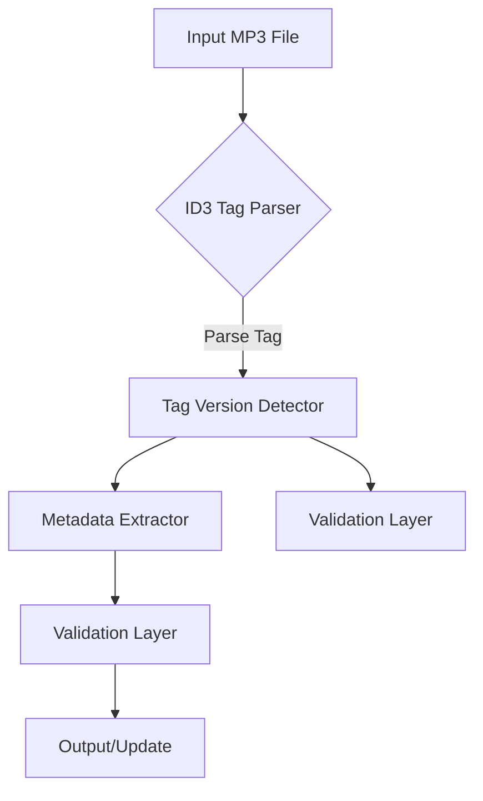

# System Patterns: ID3Tag

## Architecture Overview

### High-Level Design

## Core Components

1. **Tag Parser**
   - Responsible for initial file parsing
   - Detects tag version and structure
   - Handles different ID3 tag formats (ID3v1 only)

2. **Version Detector**
   - Identifies ID3 tag version (v1).
   - Manages version-specific parsing logic.

3. **Metadata Extractor**
   - Retrieves specific tag fields.
   - Handles encoding variations.
   - Provides type-safe metadata representation.

4. **Validation Layer**
   - Validates tag information.
   - Ensures compatibility with ID3v1 tag format.
   - Provides error reporting and correction mechanisms.

## Design Patterns

### Strategy Pattern

- Used for version-specific parsing strategies (specifically for ID3v1).
- Allows easy extension for new ID3 tag versions in the future, if
  needed.

### Factory Pattern

- Creates appropriate parser and writer instances based on tag version.
- Centralizes object creation logic.

## Error Handling Approach

- Comprehensive error categorization.
- Graceful degradation.
- Detailed logging.
- Configurable error reporting levels.

## Performance Considerations

- Minimal memory allocation.
- Efficient parsing algorithms.
- Lazy loading of metadata.
- Batch processing optimizations.

## Extensibility Points

- Plugin system for custom metadata handlers (potential future
  enhancement).
- Support for additional metadata standards (potential future
  enhancement).
- Configurable parsing and writing behaviors.

## Concurrency and Thread Safety

- Immutable metadata representations.
- Thread-safe operations.
- Non-blocking batch processing.
- Configurable parallel processing options.
